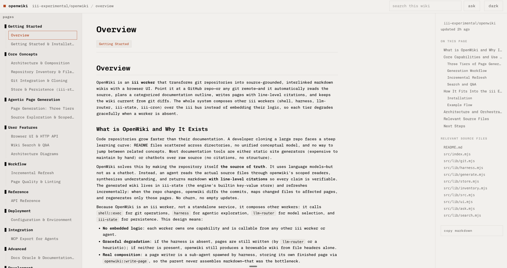
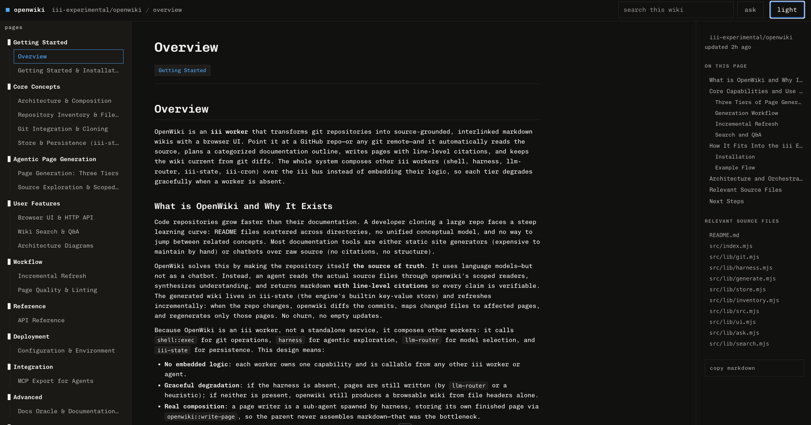

# openwiki

<p align="center">
  
  
</p>

An iii worker that builds and maintains a source-grounded, interlinked markdown
wiki for a code repository, and serves a browser UI to read and search it.

Point it at a git repo. A harness agent reads the source, plans a hierarchical
index, and delegates one writer sub-agent per page; each writer reads its files
and stores a cited page. Incremental refresh keeps the wiki current from git
diffs. Orchestration, model routing, scheduling, and the HTTP surface all run on
iii primitives; the agent is a wiki maintainer, not a chatbot.

Not published to the iii registry yet. Run it locally against a running engine.

## How it composes

openwiki is a thin orchestrator: it calls other iii workers over the bus instead
of embedding their logic, and degrades gracefully when a worker is absent.

**Generation is agent-driven.** One lead agent runs on the `harness`: it explores
the clone through openwiki's scoped readers (`openwiki::src::read` / `src::list` /
`src::grep`), plans the wiki's index, and calls `harness::spawn` itself to launch
one writer sub-agent per page in parallel. Each writer reads its own files and
stores its finished page directly with `openwiki::write-page`, so the lead never
collects page bodies. Pages stream into the UI as each writer lands, and the lead
submits only the table of contents.

**Fallbacks keep it working without the full stack.** If the harness or a model is
unavailable, openwiki drops to a two-phase plan plus bounded-parallel writers: one
`router::complete` per page (`llm-router`), and below that a heuristic tier that
builds a serviceable page from file headers with no model at all.

Git runs through `shell` (`shell::exec`) when present, otherwise a local `git`
fallback. Persistence is iii-state (engine builtin). The engine serves the UI +
JSON API over its built-in `http` triggers; each wiki's scheduled refresh runs on
its own `iii-cron` trigger (pulled in with `harness`).

Install `iii` engine before anything else:

```bash
curl -fsSL https://install.iii.dev/iii/main/install.sh | sh
```

### Workers

One command installs everything openwiki composes:

```
iii worker add harness console
```

`harness` pulls its whole stack transitively (`llm-router`, `session-manager`,
`context-manager`, `shell`, the model providers, `iii-state`, `iii-cron`, and
`web`), so you never list them yourself. `console` adds the trace + chat UI for
watching generation live. The engine serves openwiki's browser UI and JSON API
directly (the `http` trigger type is built in, no separate http worker).

openwiki degrades gracefully when a worker is absent:

| Present | Pages are |
|---|---|
| `harness` + a configured provider | agent-orchestrated, line-cited (best) |
| `llm-router` only | model-written from pre-selected files |
| neither | heuristic, built from file headers, always works |

The provider credential lives in the `llm-router` / provider config, never in
openwiki. The default model is `claude-haiku-4-5-20251001`; the browser UI's
generate form has a model picker populated from the router's live catalog
(grouped by provider), or override per call (`{"model":"..."}`) or with
`OPENWIKI_MODEL`. openwiki resolves the model against `router::models::list` and
prefers a structured-output-capable model for the harness path.

Git (clone / diff) runs through `shell` (jailed to `fs.host_roots`); if the shell
worker is absent, openwiki falls back to a local `git` on PATH.

## Local setup

```
git clone https://github.com/iii-experimental/openwiki
cd openwiki
npm install
```

Start the engine in one terminal:

```
iii                              # runs the engine; serves HTTP on :3111
```

In another, install the workers openwiki composes and run it:

```
iii worker add harness console   # pulls the whole stack + the trace UI
III_URL=ws://127.0.0.1:49134 node src/index.mjs
```

Git (clone / diff) runs through the `shell` worker (installed with `harness`), so
the clone directory (`OPENWIKI_DATA`) must resolve inside shell's `fs.host_roots`.
Without the shell worker, openwiki falls back to a local `git` on PATH.

Environment:

- `III_URL` engine WebSocket (default `ws://localhost:49134`).
- `OPENWIKI_MODEL` default generation model (default `claude-haiku-4-5-20251001`).
- `OPENWIKI_DATA` wiki store directory (default `/tmp/openwiki-data`).
- `OPENWIKI_MAX_PARALLEL` concurrent page writers (default `3`).

## Use

Open the browser UI (served on the engine's HTTP port):

```
open http://localhost:3111/openwiki
```

Or generate from the command line and browse the functions:

```
iii trigger openwiki::generate --json '{"repo_url":"https://github.com/owner/repo"}'
iii trigger openwiki::status   --json '{"id":"<wiki_id>"}'
iii trigger openwiki::pages    --json '{"id":"<wiki_id>"}'
iii trigger openwiki::page     --json '{"id":"<wiki_id>","slug":"overview"}'
iii trigger openwiki::search   --json '{"id":"<wiki_id>","q":"config"}'
```

## Verify locally

Unit tests (no engine needed):

```
npm test
```

Smoke test against a running engine. The heuristic tier needs no provider, so
this works on a bare engine:

```
iii trigger openwiki::generate --json '{"repo_url":"https://github.com/octocat/Hello-World"}'
iii trigger openwiki::status   --json '{"id":"<wiki_id>"}'   # poll until phase = ready
iii trigger openwiki::pages    --json '{"id":"<wiki_id>"}'
iii trigger openwiki::lint     --json '{"id":"<wiki_id>"}'
iii trigger openwiki::refresh  --json '{"id":"<wiki_id>"}'   # unchanged HEAD -> {"refresh":"up_to_date"}
```

With `llm-router` + a provider the pages are model-written; with the `harness`
stack they are agent-explored and line-cited. Without either, the heuristic tier
still produces a browsable wiki.

## Functions

- `openwiki::generate { repo_url, model? }` start a wiki build; returns `{ wiki_id, status }`.
- `openwiki::status { id }` generation progress.
- `openwiki::wikis` list generated wikis.
- `openwiki::models` models available via llm-router (for the UI's picker) plus the configured default.
- `openwiki::wiki { id }` wiki metadata.
- `openwiki::pages { id }` page index.
- `openwiki::page { id, slug }` a page's markdown and metadata.
- `openwiki::search { id, q }` keyword search over a wiki.
- `openwiki::refresh { id }` pull and regenerate only the pages whose source changed (incremental).
- `openwiki::set-schedule { id, schedule }` set a wiki's auto-refresh cadence (`off` | `3h` | `6h` | `12h` | `daily` | `weekly` | a cron string); also `PUT /openwiki/api/wikis/:id/schedule` and the per-wiki control in the UI.
- `openwiki::lint { id }` validate every page citation against the clone; flag thin pages.
- `openwiki::delete { id }` delete a wiki and all its pages (also available as `DELETE /openwiki/api/wikis/:id`, and as the per-wiki remove control in the UI).

Agent-facing functions the harness calls during generation (jailed to one wiki's clone):

- `openwiki::src::read { id, path, from?, to? }` read a file, optionally a line window.
- `openwiki::src::list { id, dir? }` list files (path, language, priority).
- `openwiki::src::grep { id, pattern, max? }` search file contents.
- `openwiki::write-page { id, slug, title?, category?, markdown, source_paths?, citations? }` a writer sub-agent stores its finished page; openwiki turns its citations into pinned-commit source links and rejects a page that comes back too thin.

Answer, visualize, export:

- `openwiki::ask { id, q, mode? }` cited Q&A over the wiki (`mode` = `fast` router, `deep` harness; heuristic fallback).
- `openwiki::diagram { id, kind? }` a Mermaid architecture diagram (LLM, with a deterministic structural fallback).
- `openwiki::export-agents-md { id, base_url? }` the `AGENTS.md` / `CLAUDE.md` pointer block for a repo.

MCP: openwiki registers `openwiki::read-wiki-structure`, `read-wiki-contents`, and
`ask-question`, which the `mcp` bridge advertises (as `openwiki__read-wiki-structure`
etc.) so any MCP client can browse and query a wiki.

HTTP triggers mirror the read/generate functions under `/openwiki/api/*`, and
`/openwiki` serves the UI. Page citations deep-link to source at the pinned
commit, diagrams render inline in the page, generation progress streams live
(SSE), and an **Ask** panel answers cited questions.

## How generation works

1. Clone the repo (via the `shell` worker), inventory its files, and record the
   commit so citations can deep-link to the exact source.
2. Start one lead agent on the harness. It explores the clone with the scoped
   readers and plans a hierarchical, reading-ordered index (Overview first, API
   Reference and Advanced later). The model decides how many pages and sections
   the repo needs, from a handful for a tiny repo up to a few dozen for a large
   one, and follows the repo's own docs index (`llms.txt` / a `docs/` tree) when
   present. There is no fixed category template.
3. The lead calls `harness::spawn` to launch one writer sub-agent per page, in
   parallel. Each writer reads its focused files and writes a substantial page
   (sections, a Mermaid diagram where it helps, an API-reference table where the
   page documents an API, and `path:line` citations), then stores it with
   `openwiki::write-page`. openwiki turns each citation into a pinned-commit
   source link and rejects a page that comes back too thin.
4. Pages stream to the UI as they land. The lead submits the summary and the
   table of contents; openwiki prunes the index to the pages that were actually
   written, records a page-set content hash, and marks the wiki ready.

Pages are stored in iii-state behind a lightweight page index, so large wikis
never enumerate page bodies.

## How refresh works

`openwiki::refresh` is incremental, not a full rebuild:

1. Pull the clone and read the new `HEAD`. If it matches the recorded commit, stop.
2. `git diff` the recorded commit against the new one for changed paths.
3. Map changed paths to affected pages through the file→page index; regenerate
   only those pages.
4. Gate on a content hash so an identical result does not churn the wiki, so no
   empty updates on a scheduled refresh.

## Auto-refresh schedule

Each wiki carries its own refresh cadence, set from the UI (the per-wiki
auto-refresh control) or with `openwiki::set-schedule { id, schedule }` /
`PUT /openwiki/api/wikis/:id/schedule`. Options: `off` (default), `3h`, `6h`,
`12h`, `daily`, `weekly`, or a raw cron string. Nothing is hardcoded: the global
default for a new wiki is the config worker's `refresh_default`, and every wiki
overrides it.

Setting a cadence registers a per-wiki `cron` trigger. When any fires,
`openwiki::cron::refresh-due` runs an incremental `openwiki::refresh` on each wiki
whose interval has elapsed (a content-hash gate keeps an unchanged repo from
churning). Triggers are torn down when a wiki is deleted and re-armed from the
stored schedules on restart.

## Configuration

- Model: pick one in the browser UI's generate form (populated from the router's
  live catalog, grouped by provider), pass `model` to `openwiki::generate`, or set
  `OPENWIKI_MODEL`. Any model the router advertises works. Default
  `claude-haiku-4-5-20251001`.
- Providers / credentials: live in the `llm-router` config, never in this worker.
  Add a provider (anthropic, openai, xai, codex, ...) through the console's harness
  onboarding; openwiki's picker then shows its models automatically.
- `refresh_default`: the auto-refresh cadence new wikis start with (`off` by
  default; each wiki overrides it in the UI). Editable in the console like the
  other openwiki config, or seed it with `OPENWIKI_REFRESH_DEFAULT`.

## Notes for authors

Two details that a worker of this shape must get right:

- Register all functions synchronously right after `registerWorker`. A top-level
  `await` between them lets the worker finish its handshake and register with
  zero functions.
- If you serve an inline browser UI from a template literal, use `String.raw`.
  A plain template literal strips regex backslashes and breaks the served
  script.

## License

Apache-2.0
